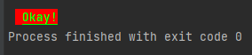
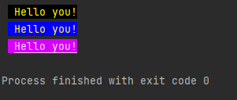

[](https://github.com/thimpat/to-ansi/blob/main/README.md)
[](https://github.com/thimpat/to-ansi/blob/main/README.md)
[](https://github.com/thimpat/to-ansi/blob/main/README.md)
[](https://www.npmjs.com/package/to-ansi)


## Convert HTML, RGB or HSL to ANSI

### Installation

```shell
npm install to-ansi
```

### Usage


```javascript

const toAnsi = require("to-ansi");

```


### Examples

#### Convert HTML to ANSI
```javascript
toAnsi.fromHexa("#00FF00");                      // => \x1b[38;5;46m 
toAnsi.fromRgb({red: 0, blue: 0, green: 255})    // => \x1b[38;5;46m 
toAnsi.fromHsl({hue: 0.5, saturation: 0.5, lightness: 0.5})
```

#### Use ANSI in console via **fromHexa** function
```javascript
console.log(
    toAnsi.fromHexa("#00FF00") +
    toAnsi.fromHexa("#FF0000", false) +
    toAnsi.STYLE.Underline +
    toAnsi.STYLE.Bold +
    "Okay" +
    toAnsi.RESET
);

```

> 

#### Use ansi in console via **getText** function

```javascript
// Yellow
console.log( toAnsi.getTextFromHex("Hello you!", {fg: "#FFFF00"}) );

// Yellow with blue background
console.log( toAnsi.getTextFromHex("Hello you!", {fg: "#FFFF00", bg: "#0000FF"}) );

// Yellow-ish on purple-lish
console.log( toAnsi.getTextFromHex("Hello you!", {fg: "#FFCCFF", bg: "#DD00FF", isUnderline: true}) );
```

> 


